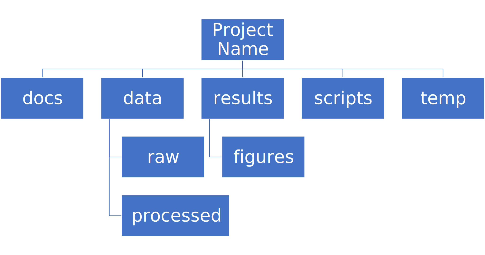

-   [Action items for 3 February
    2022](#action-items-for-3-february-2022)
-   [General project management](#general-project-management)
-   [Project planning in the abstract: Approaches to building
    code](#project-planning-in-the-abstract-approaches-to-building-code)
    -   [The single developer model: Organic code development with no
        constraints](#the-single-developer-model-organic-code-development-with-no-constraints)
    -   [The collaborative model](#the-collaborative-model)
-   [Concrete project planning](#concrete-project-planning)
    -   [Governance](#governance)
    -   [Project checklist](#project-checklist)
    -   [Herding your cats](#herding-your-cats)
    -   [Scheduling](#scheduling)
-   [Development workflow in the
    abstract](#development-workflow-in-the-abstract)
    -   [Co-dependence and feedback between tools and methods (e.g. Java
        requires more unit
        testing)](#co-dependence-and-feedback-between-tools-and-methods-e.g.-java-requires-more-unit-testing)
    -   [Choosing a language is choosing an
        ecosystem](#choosing-a-language-is-choosing-an-ecosystem)
    -   [Tool evaluation](#tool-evaluation)
-   [Concrete development workflow and
    tools](#concrete-development-workflow-and-tools)
    -   [Your development process should be
        repeatable](#your-development-process-should-be-repeatable)
    -   [TODO Dependency management and environment management by
        language](#todo-dependency-management-and-environment-management-by-language)
    -   [Issue Tracking](#issue-tracking)
    -   [Testing and Validation](#testing-and-validation)
    -   [Version Control](#version-control)
-   [Documentation](#documentation)
    -   [Documentation should describe what you actually
        do](#documentation-should-describe-what-you-actually-do)
    -   [Documentation workflow](#documentation-workflow)
-   [Examples and flow diagrams](#examples-and-flow-diagrams)
    -   [Critiquing a sample project](#critiquing-a-sample-project)
-   [Discussion: How are you stuck?](#discussion-how-are-you-stuck)
-   [References](#references)
-   [Coda: The cloud is just someone else\'s
    computer](#coda-the-cloud-is-just-someone-elses-computer)
-   [Old stuff](#old-stuff)
    -   [General throat clearing](#general-throat-clearing)
    -   [Tools](#tools)
    -   [Data and file management](#data-and-file-management)

# Action items for 3 February 2022

1.  Review narrative order: rearrange, delete, and add topics
2.  Fill in \"Dependency management and environment management by
    language\"
3.  Worked examples and walk-throughs (projects or tools)
4.  Flow diagrams
5.  Presentation format (bookdown, powerpoint, screaming into the void)
6.  Who wants to do what?

# General project management

What kind of project do you have? Things to consider:

-   Small vs. large
-   Existing constraints: Required language, packages, computing
    environment
-   How much of a driver\'s seat do you have?

# Project planning in the abstract: Approaches to building code

## The single developer model: Organic code development with no constraints

1.  Work from the inside out. Increase the complexity and generality of
    your code as circumstances demand.
2.  Given (1), commit to rewriting your code on an ongoing basis.
3.  Use code organization (functions, objects, modules, etc.) to reduce
    cognitive overhead
    1.  Compartmentalizing your code makes it easier to navigate and
        understand
    2.  Code chunks that are truly done can be \"frozen\" as
        compartmentalized functions or modules, making it easier to
        reason about and rewrite the remaining code
4.  Preserve useful practices across projects by developing a standard
    approach and toolkit

## The collaborative model

### TODO Diagram of combinatorial explosion

### To scaffold from single person to a large project, you need coordination and planning

1.  Coordination and planning for code
    1.  Functional divisions: Organize the code base into (somewhat)
        separable concerns
    2.  Each functional division should have a functional lead (the
        point person who makes sure that work moves forward). Depending
        on project size, they may be the only person.
    3.  Functional interfaces: How do the functional pieces work
        together or communicate? This can be implicit (we all agree how
        it\'s going to work) or explicit (we write an API for different
        parts of the code to communicate). APIs are generally the
        hallmark of a large code base, and overkill for a small one.
        However, it\'s still important to think about how the parts of
        the project work together, because it requires explicit
        collarboration in the design and in determining what can be
        released when.
2.  Coordination and planning for people
    1.  Release schedule: What goes in what release? Who works on what?
    2.  Integrating new team members
    3.  Assigning new issues and bug fixes
    4.  Repository management: Branching strategy, merging, tagging
    5.  Test and release oversight: Have we done enough testing? Do we
        release with known bugs? Do we delay releases? Do we revisit
        these decisions as our hypothetical due date slips further into
        the past?

### However! Your planning process needs to be responsive to emerging needs and discoveries. In other words, you need to recapture some \"organic\" code development within your system.

1.  Versioned releases containing planned improvements and fixes (\"in
    3.1, we will add...\")
2.  Rules for deprecation (e.g. overloading APIs, offering alternative
    APIs) as the project expands or changes.
3.  Community bug reports and feature requests
4.  User field studies (telemetry is too narrow; what you really want
    are patterns of behavior. What irritates or stumps people when they
    try to use the code?)

# Concrete project planning

## Governance

How are decisions made? Who makes them?

## Project checklist

1.  What are the deliverables? Code, analyses, figures, white papers,
    journal publications, etc.
2.  What is the time scale for the deliverables?
3.  Who are the responsible parties for each of the deliverables?
4.  What are the dependencies? For example: Data analysis requires data
    cleanup and validation, writing code, testing code
5.  What are the **implied** dependencies?
    1.  Documentation
    2.  Testing
    3.  Backups
    4.  System administration (installation, upgrades, there\'s only one
        person who knows how to troubleshoot network errors, etc.)
    5.  Training

## Herding your cats

1.  By default, give everyone access to everything
2.  Establish a common workflow for collaborating on code (e.g., \"we
    share all code in a private Github repository\")
3.  Establish a common workflow for collaborating on documents
4.  Large group? Delegate to team leads.

## Scheduling

A common conversation on development teams:

Q: \"How long will X take?\"

A: \"Four weeks\"

X is irrelevant. From this we learn that there are two kinds of
schedules:

1.  Evidence-based schedules
2.  Lies

### Evidence-based scheduling

cf.
<https://www.joelonsoftware.com/2007/10/26/evidence-based-scheduling/>

1.  Estimate task time
2.  Start the clock
3.  Complete the task
4.  Stop the clock
5.  Assess accuracy
6.  Weight new estimates

### Some comments on evidence-based scheduling

1.  You can estimate the task time using time or \"points\" (i.e. the
    relative size of tasks)
2.  Note the missing step: You don\'t stop the clock when you go
    off-task in (3). This is deliberate; your inability to predict
    interruptions is one of the major sources of estimation error.
3.  You can assess the accuracy of your schedule estimates by eyeball or
    by using regression, depending on your commitment to the bit.

### An aside about \"methodologies\"

There are many \"methodologies\" (Kanban, Agile, etc.). Just ignore
them.

You have a pile of work.

1.  Try to organize the work in to bite-size chunks
2.  Try to keep track of who's doing what
3.  Try to do the important stuff first

### An aside about boiling the ocean

Start small and build the code in a way that scales. Don\'t jump to the
next level of complexity until you need it.

1.  <https://adamdrake.com/command-line-tools-can-be-235x-faster-than-your-hadoop-cluster.html>
2.  <https://livefreeordichotomize.com/2019/06/04/using_awk_and_r_to_parse_25tb/>

# Development workflow in the abstract

## Co-dependence and feedback between tools and methods (e.g. Java requires more unit testing)

1.  What is your goal?
2.  What products will you make to meet your goal?
3.  What tools are available?
4.  Decisions you have to make given on constraints; e.g. language,
    libraries, computing environments?
5.  How do you make decisions about workflow and tools? Does this fit
    into your overall decision-making process as described above?
6.  How much mixing of environments? outside API, databases, etc? Total
    compute needs? These issues are a blend of \"how many outside
    drivers are you willing to accept?\" and \"how much do you plan to
    grow?\"

## Choosing a language is choosing an ecosystem

### Language features

A language (and some of its libraries) is maintained by a core team, and
has a sales pitch about what makes it neat in theory. However, the core
language features are not enough; there are additional practical
considerations:

1.  **Community**. This can include forums, documentation, Q&A sites,
    and other evidence of enthusiastic hobby and personal use. It\'s
    easy to find help on how to get started. There is evidence of
    continuing organic support for the language ecosystem.
2.  **Tools**. Features that make the language usable in day-to-day
    work, including: Code editor support, syntax highlighting,
    debuggers, profiling, tools for packaging and deployment, version
    control, testing, automated doc extraction, and integration with
    outside tools (web servers, databases, interchange formats like
    XML/JSON). Some of this will be included in Core Libraries.
3.  **Working deployments**. You see the language being used in
    real-world projects. The pitfalls for deployment, performance, and
    scaling are well-known and documented. The community has confidence
    in (mostly) bug-free operation. Edge cases, errata, and know bugs
    are documented. There is a community of understanding around how to
    use the tool effectively and avoid tarpits.

### When is a language ready?

-   <https://apenwarr.ca/log/20190318>

In general, a language ecosystem will do some things well and other
things poorly. Some examples:

1.  Julia: Good tools and community, but we don't see it widely deployed
2.  Rust: Checks all boxes, but don't have a lot of deployed examples
    for scientific computing **specifically**. Example of a promising
    ecosystem.
3.  Many proprietary statistics tools: Little to no organic support for
    integrating into a wider toolchain, which can be problematic from a
    purely practical standpoint.

## Tool evaluation

All code, tools, and management practices have an opportunity cost: The
time you spend coding, supporting, teaching, and managing could have
been spent doing something else. You should adopt tools that are a net
benefit to your project.

# Concrete development workflow and tools

## Your development process should be repeatable

This means a collaborator (or future you) should be able to:

1.  Spin up a new development environment with all the dependencies
2.  Understand what your code does
3.  Recreate your files
4.  Recreate your analyses
5.  Distinguish between raw and processed data
6.  Prove your code does what it claims to do

## TODO Dependency management and environment management by language

### Python

1.  Conda package manager and environments (cf.
    <https://github.com/devnich/catalina-setup#install-python-anaconda-distribution>
    )
2.  Pip and virtualenv

### R

### Java

### When does it make sense to use containers?

Containers and VMs add an additional maintenance and testing burden. It
may still make sense to use them if:

1.  Your code needs to run on a remote environment (e.g. UCSD
    Supercomputing). In this case, using a container for setup and
    teardown may ultimately save time.
2.  You need to repeatedly recreate a computing environment.

## Issue Tracking

### Key features

1.  Issue title
2.  Issue description
3.  Issue creator
4.  Current assignee
5.  Status
6.  Dates (created, resolved, closed, re-opened)
7.  Comments
8.  Topic tags, version tags, etc
9.  Version control integration (\"fixed by commit X\"; this is a
    nice-to-have but not necessary feature)
10. Support for searching, filtering, and sorting

### Options

1.  Free
    -   Github project issues
2.  Free-ish
    -   Trello
    -   Microsoft Planner
3.  Paid (sometimes fiddly)
    -   Airtable
    -   Jira
    -   Many many others
4.  Locally-hosted (fiddly)
    -   Fossil
    -   Trac

## Testing and Validation

How do you know your code does what you say it does? A taxonomy of
testing strategies, from simple to complex:

1.  Defensive coding
    1.  Assume your inputs are bad, and include tests of input
        correctness in your code.
    2.  Use `assert` statements (sparingly) for things that should never
        break.
2.  Unit tests: Generally overkill (not enough return for time
    invested). Use selectively in places where the code tends to change
    a lot.
3.  Integration testing: The sweet spot for small-to-medium projects.
    For example:
    1.  Start with a vetted sample input file
    2.  Generate intermediate data and compare to known intermediate
        data
    3.  Run analyses and compare results to known results
    4.  Write results to output and compare with known output file (this
        is different than 3!)

## Version Control

Oh god I broke it.

### The exhortation

1.  No one wants to eat their vegetables
2.  If you don\'t eat your vegetables you\'ll die
3.  Eat your vegetables

### Version control in practice

1.  One branch should always be deliverable, working code. Typically
    this is \"main\".
2.  New work happens on development branches.
3.  Merge new work using a \"general and lieutenants\" workflow:
    1.  Developer (\"lieutenant\") pushes development branch to shared
        repository
    2.  Project lead (\"general\") merges development branch into main
        branch, or talks to developer if there\'s a conflict
4.  There are many possible workflows; the more your team knows, the
    more options you have.

# Documentation

## Documentation should describe what you actually do

Contextualize all the things!

1.  Why did you make this decision?
2.  How does this work?

## Documentation workflow

You want an easy-to-use collaborative workflow. Here are some options
(not mutually exclusive):

1.  Explanatory code comments
2.  README files (Github will render Markdown README files as nice web
    pages)
3.  Github wiki
4.  Many other wikis
5.  Word documents in Dropbox, I guess? Sometimes you have to make
    compromises.

# Examples and flow diagrams

## Critiquing a sample project

<https://github.com/devnich/portfolio-factors>

### Big picture questions

1.  What does this do?
2.  Who is this for?
3.  How can I run this?
4.  How can I contribute to this?

### Documentation

1.  High-level goal in Github description but not in Read Me
2.  High-level navigation overview is important, and separate from /
    more abstract than function descriptions
3.  Need to describe enabled workflows

### Code comments and organization

1.  Expand function descriptions
2.  Describe input parameters with sufficient detail that the user can
    distinguish legal from illegal inputs (unit test sample data can
    assist with this)

### Issue tracking

1.  Code is littered with TO DOs; these should be turned into issues
2.  Give your code reviewers the ability to assign you issues.
3.  Take the underlying motivation for the suggestion seriously (this
    goes somwhere else) "Remember: when people tell you something's
    wrong or doesn't work for them, they are almost always right. When
    they tell you exactly what they think is wrong and how to fix it,
    they are almost always wrong." - Neil Gaiman (cf.
    <https://neil-gaiman.tumblr.com/post/22573969110/for-all-the-people-who-ask-me-for-writing>)

### Code generality

1.  Processing workflow is fragile, in that it relies on the author\'s
    in-depth knowledge of what does and doesn\'t work

### Tests

#### Unit Tests

1.  Is the math correct?
2.  Input validation
3.  How do we handle pathological inputs (e.g., colinearity)?

#### Integration tests (needs examples)

1.  What are the theoretically possible workflow paths?
2.  Which ones are implemented? If you pull on this thread, you will
    discover that your code implements many partial workflows. This is a
    huge source of confusion for future users and maintainers. When you
    discover a partial workflow, you can clean up and/or reorganize in
    one of three ways:
    1.  Finish implement the complete workflow
    2.  Strip out the workflow entirely. This usually requires more work
        that the alternatives.
    3.  Explicitly stub out the un-implemented parts. The simplest way
        to do this is to leave comments: \"X, Y, Z cases aren\'t handled
        yet. When you try them, we attempt to return an informative
        error.\"
3.  Which ones are tested?

### Deployment

i.e. where is the lever I pull to make this go?

1.  Packaged environment and dependencies
    1.  .condarc
    2.  environment.yml file
2.  Description of environment and dependencies (otherwise how will we
    debug?)
    1.  git version
    2.  python version
    3.  shell type (bash, zsh, sh, dash, powershell)
    4.  Have you tested this on Windows? I see by your face that you
        haven\'t.
3.  You can solve this problem with Docker!
    1.  Now you have two problems.
    2.  Containerizing more likely to pay of in circumstances where you
        have to deploy to the cloud anyway (e.g., you are building and
        tearing down instances at UCSD Supercomputing)

### How do we know when we\'re done?

1.  Extensible enough
2.  General enough
3.  Robust enough
4.  Tested enough

# Discussion: How are you stuck?

# References

1.  Peopleware: Productive Projects and Teams (DeMarco & Lister)

    One of the few project management books that doesn\'t suck.
    Specifically about managing software projects, but contains a lot of
    generally useful guidance.

2.  The Mythical Man-Month (Brooks)

    This has all happened before; this will all happen again. Fred
    Brooks tells stories of software projects gone bad.

3.  Getting to Yes: Negotiating Agreement Without Giving In (Fisher &
    Ury)

    You can\'t just give people orders all the time.

4.  The Workflow of Data Analysis Using Stata (Long)

    Lots of generic advice about data management.

5.  Clean Code (Martin)

# Coda: The cloud is just someone else\'s computer

Someone\'s slow, expensive computer

-   <https://news.ycombinator.com/item?id=23314973>

  AWS                     Free or DIY
  ----------------------- -----------------------------
  Route 53                NSD
  WAF                     modsecurity
  SES                     Postfix
  Inspector               OSSEC
  GuardDuty               Snort
  Data Pipeline           cron and bash
  Athena                  Prestodb
  Glue                    Hive Metastore and Spark
  OpsWorks                Chef
  VPC                     a VLAN
  Snowball                a truck full of hard drives
  CloudWatch              syslogd
  Neptune                 Neo4j
  ElastiCache             Redis
  DynamoDB                MongoDB
  S3 Glacier              DVD backup
  EFS                     NFS
  Elastic Block Store     a SAN
  Elastic Beanstalk       Apache Tomcat
  EMR                     Apache Hadoop
  Elastic Cloud Compute   a virtual machine
  Kinesis                 Apache Kafka
  QuickSight              Tableau

# Old stuff

## General throat clearing

1.  This is a highly opinionated talk.
2.  Experienced software developers can rant for hours about the things
    you **must** do or **must not** do, but the list of things that you
    must or must not do is actually quite short (e.g., you must make
    backups. No one disputes this).
3.  However, there are many activities for which you should have a
    process. The exact process doesn\'t matter, what matters is that you
    **have** a process and it works for you.
4.  The purpose of this talk is to help you think through your workflow
    and options, and come up with a process that works for you. We have
    opinions (see 1), but these opinions are based on our experiences
    building processes for our individual circumstances.

## Tools

The real open source mantra should be: "Information wants to be
exchangeable." You should view all of your tools as components of a
loosely-coupled workflow.

### Publishing and markup languages

#### Simplified markup

1.  Markdown (Github and many other places)
2.  reStructured Text (Python and Sphinx documentation)
3.  Org-mode (Emacs)

#### Complex markup

1.  Latex (document publishing)
2.  HTML (web and ebook publishing)

### Code Editors

The short version: There are many editors, and everyone should try to
find one that suits them.

cf.
<https://github.com/elliewix/Ways-Of-Installing-Python/blob/master/ways-of-installing.md#the-grand-trio-of-tools>

### Helpful Tools

Lots of little tools that are complimentary to your main toolchain.
Examples include: shell (bash), pandoc, graphviz/dot, SQL, tree, stow,
awk, sed...

## Data and file management

### Your goal: Maintain the integrity of your distributed file system

Q: \"What if everything was distributed?\"

A: \"Everything **is** distributed.\"

Every research group has an M to N to O mapping of Researchers to
Machines to Files. The goal is to maintain the integrity of that
many-to-many-to-many mapping.

### Project File Structure

cf. <https://doi.org/10.1371/journal.pcbi.1000424> via
<https://github.com/leonjessen/talks>

A nice feature of this kind of directory structure is that it lends
itself to automation.

### Naming Things

\"The two hardest problems in computer science are cache invalidation,
naming things, and off-by-one errors.\"

-   <https://twitter.com/secretGeek/status/7269997868>

#### Basics of naming

\<meaningful name\> . \<file extension\>

1.  Use meaningful names, with some kind of systematic convention. An
    example of embedding metadata in the name is the BIDS file naming
    format: <https://github.com/bids-standard>
2.  Prefer underscores to hyphens, never use spaces
3.  For software, use either Semantic versioning or Calendar versioning.
4.  For data files, results, and documents, you probably want Calendar
    versioning. Your scripts can automatically name things!

#### Semantic versioning

\<major version\> . \<minor version\> . \<bugfix version\> . \<file
extension\>

"project_author_2.7.4.txt"

"study_condition_4.2.11.out"

#### Calendar versioning

\<meaningful name\> . \<ISO date\> . \<increment\> . \<file extension\>

"project_author_20190327.3.txt"

"study_condition_20181105.5.out"

### Data Formats

1.  Use a sensible representation and follow standards where they exist.
    Examples of sensible representations:
    1.  Tabular: Excel, CSV, TSV
    2.  Tree-structured data interchange: XML, JSON, RDF
    3.  Tabular with complex relations: Relational database (SQLite,
        PostgreSQL)
2.  Prefer \"open\" data formats. This means:
    1.  unencumbered by patents or royalties
    2.  interoperable with common tools

### Backups

"There are two kinds of people: Those who make backups, and those who
will make backups."

-   Gregory A. Miller
