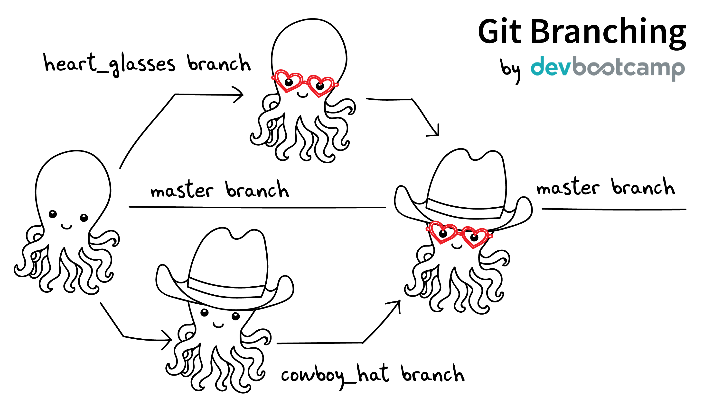

-   [Introduction](#introduction)
-   [General project management](#general-project-management)
-   [Project planning in the abstract: Approaches to building code](#project-planning-in-the-abstract-approaches-to-building-code)
    -   [The single developer model: Organic code development with no constraints](#the-single-developer-model-organic-code-development-with-no-constraints)
    -   [The collaborative model](#the-collaborative-model)
-   [Concrete project planning](#concrete-project-planning)
    -   [Governance](#governance)
    -   [Project checklist](#project-checklist)
    -   [Herding your cats](#herding-your-cats)
    -   [Scheduling](#scheduling)
-   [Development workflow in the abstract](#development-workflow-in-the-abstract)
    -   [Choosing a language is choosing an ecosystem](#choosing-a-language-is-choosing-an-ecosystem)
    -   [Co-dependence and feedback between tools and methods](#co-dependence-and-feedback-between-tools-and-methods)
    -   [Tool evaluation](#tool-evaluation)
-   [Concrete development workflow and tools](#concrete-development-workflow-and-tools)
    -   [Your development process should be repeatable](#your-development-process-should-be-repeatable)
    -   [Testing and Validation](#testing-and-validation)
    -   [Version Control](#version-control)
    -   [Issue Tracking](#issue-tracking)
    -   [Dependency management and environment management by language](#dependency-management-and-environment-management-by-language)
    -   [Deployment](#deployment)
    -   [How do we know when we\'re done?](#how-do-we-know-when-were-done)
-   [Documentation](#documentation)
    -   [Documentation should describe what you actually do](#documentation-should-describe-what-you-actually-do)
    -   [Documentation workflow](#documentation-workflow)
-   [Breakout Room Discussion](#breakout-room-discussion)
    -   [Sample project for people without a project of their own](#sample-project-for-people-without-a-project-of-their-own)
-   [Group Discussion](#group-discussion)
-   [References](#references)
-   [Coda: The cloud is just someone else\'s computer](#coda-the-cloud-is-just-someone-elses-computer)

# Introduction

Domain expertise comprises two complementary forms of knowledge: Explicit knowledge and a culture of practice. We often underestimate how much of our domain expertise is in the doing, not the knowing. Working scientists (for example) are highly skilled at choosing tractable research questions, designing informative studies, making principled guesses about the nature of missing data, etc, etc. Some of this can be documented; some of it is embodied in the practice of the craft, and attempts to document it end with your desk covered in Post-Its saying things like \"Do the right thing here!\"

The field of software development (which you can think of as \"writing code\", but, like, BIGGER) also has explicit knowledge and culture of practice. You\'ve probably encountered some of the explicit knowledge in the form of tutorials, cookbooks, language specs, maybe even some comments on best practices. You probably haven\'t encountered the culture of practice.

Writing code (but, like, BIGGER!) is hard. Learning some of the practices that have evolved within software development community can make it (somewhat) easier. Our goal is to transmit some of those best practices, and talk about how you can adapt them to the projects that you\'re working on right now.

Things to think about as we talk:

1.  Where are you stuck on your own projects?
2.  Can \<tool X\>/\<practice X\> help you?
3.  What else would you need to know to effectively make use of them?

# General project management

1.  What are we talking about when we talk about project management?
    1.  Project management: Organizing people, tasks, and timelines in the pursuit of goals. This is probably what you think about when you hear the phrase \"project management\"
    2.  Data management: Gathering data, cleaning and verifying data, making backups and archives. Most researchers have some experience with this. Requires an organizational system and workflow, so somewhat analogous to software project management.
    3.  Software project management: Managing the development of software. This means managing the project (see 1), but also managing the *development*. This means managing a group of people who are trying to write (correct, pertinent) code, and making informed choices about language, tools, and work flows that support writing that code.
2.  What kind of project do you have? Things to consider:
    -   Small vs. large (the practices still work if it\'s just you, but you have more flexibility)
    -   Existing constraints: Required language, packages, computing environment
    -   How much of a driver\'s seat do you have?

# Project planning in the abstract: Approaches to building code

## The single developer model: Organic code development with no constraints

1.  Work from the inside out. Increase the complexity and generality of your code as circumstances demand.
2.  Given (1), commit to rewriting your code on an ongoing basis.
3.  Use code organization (functions, objects, modules, etc.) to reduce cognitive overhead
    1.  Compartmentalizing your code makes it easier to navigate and understand
    2.  Code chunks that are truly done can be \"frozen\" as compartmentalized functions or modules, making it easier to reason about and rewrite the remaining code
4.  Preserve useful practices across projects by developing a standard approach and toolkit

## The collaborative model

### The fundamental problem of project management

Communication channels grow as the square of the number of people: n(n -1) / 2

cf. <https://en.wikipedia.org/wiki/Complete_graph>

-   2 people - 1 channel

    

-   3 people - 3 channels

    

-   4 people - 6 channels

    

-   5 people - 10 channels

    

-   8 people - 28 channels

    

-   12 people - 66 channels

    

### To scaffold from single person to a large project, you need coordination and planning

#### Coordination and planning for code

1.  Functional divisions: Organize the code base into (somewhat) separable concerns
2.  Each functional division should have a functional lead (the point person who makes sure that work moves forward). Depending on project size, they may be the only person.
3.  Functional interfaces: How do the functional pieces work together or communicate? This can be implicit (we all agree how it\'s going to work) or explicit (we write an API for different parts of the code to communicate). APIs are generally the hallmark of a large code base, and overkill for a small one. However, it\'s still important to think about how the parts of the project work together, because it requires explicit collaboration in the design and in determining what can be released when.

#### Coordination and planning for people

1.  Release schedule: What goes in what release? Who works on what?
2.  Integrating new team members
3.  Assigning new issues and bug fixes
4.  Repository management: Branching strategy, merging, tagging
5.  Test and release oversight: Have we done enough testing? Do we release with known bugs? Do we delay releases? Do we revisit these decisions as our hypothetical due date slips further into the past?

### However! Your planning process needs to be responsive to emerging needs and discoveries

#### You want to recapture some of that \"organic\" code development

1.  Versioned releases containing planned improvements and fixes (\"in 3.1, we will add...\")
2.  Rules for deprecation (e.g. overloading APIs, offering alternative APIs) as the project expands or changes.
3.  Community bug reports and feature requests
4.  User field studies (telemetry is too narrow; what you really want are patterns of behavior. What irritates or stumps people when they try to use the code?)

#### You want to avoid doing unnecessary work

What\'s the difference between \"enough\" code organization and \"too much\" code organization? If you\'re making things that you\'ll never use, you\'re spending too much time organizing and not enough time doing. That\'s how you end up with AbstractSingletonProxyFactoryBean:
<https://docs.spring.io/spring-framework/docs/2.5.x/javadoc-api/org/springframework/aop/framework/AbstractSingletonProxyFactoryBean.html>

# Concrete project planning

These are things which should be written as documentation during the project development phase. Writing this alongside your DMP will help develop the overall design.

(Project planning is all about checklists. There are no cool graphics for project planning).

## Governance

How are decisions made? Who makes them?

For large, complicated projects, decision-making responsibility can be distributed by expertise (consulting statistician, system administrator), accountability (grant PI, campus security officer), and/or authority (PI, funding source, multi-site project lead).

## Project checklist

1.  What are the **deliverables**? Code, analyses, figures, white papers, journal publications, etc. This constrains everything that follows.
2.  What is the **timetable** for the deliverables?
3.  Who are the **responsible parties** for each of the deliverables?
4.  What are the **dependencies**? For example: Data analysis requires data cleanup and validation, writing code, and testing the code.
5.  What are the **implied dependencies**?
    1.  Documentation
    2.  Testing
    3.  Backups
    4.  System administration (installation, upgrades, there\'s only one person who knows how to troubleshoot network errors, etc.)
    5.  Training

## Herding your cats

1.  By default, give everyone access to everything. If you can\'t do this, you have a new implied dependency: Security.
2.  Establish a common workflow for collaborating on code (e.g., \"we share all code in a private Github repository\")
3.  Establish a common workflow for collaborating on documents
4.  Large group? Delegate to team leads.

## Scheduling

A common conversation on development teams:

Q: \"How long will X take?\"

A: \"Four weeks\"

X is irrelevant. From this we learn that there are two kinds of schedules:

1.  Evidence-based schedules
2.  Lies

### Evidence-based scheduling

cf. <https://www.joelonsoftware.com/2007/10/26/evidence-based-scheduling/>

1.  Estimate task time
2.  Start the clock
3.  Complete the task
4.  Stop the clock
5.  Assess accuracy
6.  Weight new estimates

### Some comments on evidence-based scheduling

1.  You can estimate the task time using time or \"points\" (i.e. the relative size of tasks)
2.  Note the missing step: You don\'t stop the clock when you go off-task in (3). This is deliberate; your inability to predict interruptions is one of the major sources of estimation error.
3.  You can assess the accuracy of your schedule estimates by eyeball or by using regression, depending on your commitment to the bit.

### An aside about \"methodologies\"

There are many \"methodologies\" (Kanban, Agile, etc.). Just ignore them.

You have a pile of work.

1.  Try to organize the work in to bite-size chunks
2.  Try to keep track of who's doing what
3.  Try to do the important stuff first

### An aside about boiling the ocean

A common mistake is trying to build everything at once. Start small and build the code in a way that scales. Don\'t jump to the next level of complexity until you need it.

1.  <https://adamdrake.com/command-line-tools-can-be-235x-faster-than-your-hadoop-cluster.html>
2.  <https://livefreeordichotomize.com/2019/06/04/using_awk_and_r_to_parse_25tb/>

# Development workflow in the abstract

## Choosing a language is choosing an ecosystem

Your workflow and available tools are depend in part on the language you\'re using, so let\'s talk about that for a minute before diving into more specifics.

### Language features

A language (and some of its libraries) is maintained by a core team, and has a sales pitch about what makes it neat in theory. However, the core language features are not enough; there are additional practical considerations:

1.  **Community**. This can include forums, documentation, Q&A sites, and other evidence of enthusiastic hobby and personal use. It\'s easy to find help on how to get started. There is evidence of continuing organic support for the language ecosystem.
2.  **Tools**. Features that make the language usable in day-to-day work, including: Code editor support, syntax highlighting, debuggers, profiling, tools for packaging and deployment, version control, testing, automated doc extraction, and integration with outside tools (web servers, databases, interchange formats like XML/JSON). Some of this will be included in Core Libraries.
3.  **Working deployments**. You see the language being used in real-world projects. The pitfalls for deployment, performance, and scaling are well-known and documented. The community has confidence in (mostly) bug-free operation. Edge cases, errata, and know bugs are documented. There is a community of understanding around how to use the tool effectively and avoid tarpits.

### When is a language ready?

-   <https://apenwarr.ca/log/20190318>

In general, a language ecosystem will do some things well and other things poorly. Some examples:

1.  Julia: Good tools and community, but we don't see it widely deployed (this might be changing, watch this space)
2.  Rust: Checks all boxes, but don't have a lot of deployed examples for scientific computing **specifically**. Example of a promising ecosystem.
3.  Many proprietary statistics tools: Little to no organic support for integrating into a wider toolchain, which can be problematic from a purely practical standpoint.

## Co-dependence and feedback between tools and methods

1.  What is your goal?
2.  What products will you make to meet your goal?
3.  What tools are available?
4.  What decisions do you have to make given pre-existing constraints on, e.g., language, libraries, computing environments?
5.  How do you make decisions about workflow and tools? Does this fit into your overall decision-making process as described above?
6.  How much mixing of environments? outside API, databases, etc? Total compute needs? How flexible and/or expansive do you need to be? These issues are a blend of \"how many outside drivers are you willing to accept?\" and \"how much do you plan to grow?\"

## Tool evaluation

-   <https://xkcd.com/1205/>

All code, tools, and management practices have an opportunity cost: The time you spend coding, supporting, teaching, and managing could have been spent doing something else. You should adopt tools that are a net benefit to your project.

# Concrete development workflow and tools

In order of importance, roughly.

## Your development process should be repeatable

This means a collaborator (or future you) should be able to:

1.  Spin up a new development environment with all the dependencies (this is a continuum, with \"How To\" docs at on end and Docker build files at the other)
2.  Understand what your code does
3.  Recreate your files
4.  Recreate your analyses
5.  Distinguish between raw and processed data
6.  Prove your code does what it claims to do

## Testing and Validation

How do you know your code does what you say it does? A taxonomy of testing strategies, from simple to complex:

1.  Defensive coding
    1.  Assume your inputs are bad, and include tests of input correctness in your code.
    2.  Use `assert` statements (sparingly) for things that should never break.
2.  Unit tests: Can be overkill (not enough return for time invested). Many languages have unit test libraries as part of their core offering (e.g., Java, Python). Use selectively for:
    1.  Input validation
    2.  Calculation validation
    3.  Places where the code tends to change a lot
3.  Integration testing: The sweet spot for small-to-medium projects. For example:
    1.  Start with a vetted sample input file
    2.  Generate intermediate data and compare to known intermediate data
    3.  Run analyses and compare results to known results
    4.  Write results to output and compare with known output file (this is different than 3!)

### The metaphysics of integration/system testing

1.  What are the theoretically possible workflow paths?
2.  Which ones are implemented? If you pull on this thread, you will discover that your code implements many partial workflows. This is a huge source of confusion for future users and maintainers. When you discover a partial workflow, you can clean up and/or reorganize in one of three ways:
    1.  Finish implementing the complete workflow
    2.  Strip out the workflow entirely. This usually requires more work that the alternatives.
    3.  Explicitly stub out the un-implemented parts. The simplest way to do this is to leave comments: \"X, Y, Z cases aren\'t handled yet. When you try them, we attempt to return an informative error.\"
3.  Which ones are tested?

## Version Control

### Version control preserves a record of your changes over time

### Version control allows you to fearlessly collaborate

### Version control in practice

1.  One branch should always be deliverable, working code. Typically this is \"main\".
2.  New work happens on development branches.
3.  Merge new work using a \"general and lieutenants\" workflow:
    1.  Developer (\"lieutenant\") pushes development branch to shared repository
    2.  Project lead (\"general\") merges development branch into main branch, or talks to developer if there\'s a conflict
4.  There are many possible workflows; the more your team knows, the more options you have.

## Issue Tracking

### Key features

1.  Issue title
2.  Issue description
3.  Issue creator
4.  Current assignee
5.  Status
6.  Dates (created, resolved, closed, re-opened)
7.  Comments
8.  Topic tags, version tags, etc
9.  Version control integration (\"fixed by commit X\"; this is a nice-to-have but not necessary feature)
10. Support for searching, filtering, and sorting

### Many options

Github, Trello, Microsoft Planner, Airtable, Jira, Fossil, Trac...

### Demo

Github, because you\'re probably already using it

## Dependency management and environment management by language

Broadly speaking, you want to be able to set up a self-contained environment that contains all of your weird dependencies, such that you can tear it down and rebuild it if something goes wrong.

-   <https://xkcd.com/1987/>

### Python

1.  Conda package manager and environments (cf. <https://github.com/devnich/catalina-setup#install-python-anaconda-distribution>)
2.  Pip and virtualenv

### R

1.  renv: <https://rstudio.github.io/renv/articles/renv.html>
2.  Read about additional options here: <https://github.com/DataCurationNetwork/data-primers/blob/master/R%20Data%20Curation%20Primer/R-data-curation-primer.md>

### SQL

Integrates with almost every language; check your language docs for usage information.

### Parallel concerns for other languages

### When does it make sense to use containers?

Containers and VMs add an additional maintenance and testing burden. It may still make sense to use them if:

1.  Your code needs to run on a remote environment (e.g. UCSD Supercomputing). In this case, using a container for setup and teardown may ultimately save time.
2.  You need to repeatedly recreate a computing environment.

## Deployment

Where is the lever I pull to make this go? If you have an answer for dependency management, the deployment (i.e. automatic recreation of your code in its environment) is trivial.

1.  Packaged environment and dependencies
    1.  .condarc
    2.  environment.yml file
2.  Description of environment and dependencies (otherwise how will we debug?)
    1.  git version
    2.  python version
    3.  shell type (bash, zsh, sh, dash, powershell)
    4.  Have you tested this on Windows? I see by your face that you haven\'t.
3.  You can solve this problem with Docker!
    1.  Now you have two problems.
    2.  Containerizing more likely to pay off in circumstances where you have to deploy to the cloud anyway (e.g., you are building and tearing down instances at UCSD Supercomputing)

## How do we know when we\'re done?

1.  General enough
2.  Robust enough
3.  Extensible enough
4.  Tested enough

# Documentation

## Documentation should describe what you actually do

Contextualize all the things!

1.  Why did you make this decision?
2.  How does this work?

## Documentation workflow

You want an easy-to-use collaborative workflow. Here are some options (not mutually exclusive):

1.  Explanatory code comments
2.  README files (Github will render Markdown README files as nice web pages)
3.  Github wiki
4.  Many other wikis
5.  Word documents in Dropbox, I guess? Sometimes you have to make compromises.

# Breakout Room Discussion

Discuss one of your projects (or the sample project listed at the end of this section) with your newfound friends and collaborators. Here are some issues for you to think about:

1.  Big picture questions
    1.  What is the goal of this project?
    2.  Who is the code for? Is it for the author, or should other people be able to use and/or contribute to it?
    3.  How would I run this code? Do I have the information I need to do that?
2.  Code comments and organization
    1.  Are there docstrings for classes and functions (i.e. \"this function does X\")?
    2.  Are the input parameters described with sufficient detail that the user can distinguish legal from illegal inputs?
    3.  Is it possible to run the code in a way that causes it to break (e.g. what happens if you call functions \"out of order\")?
    4.  What\'s missing? Are there unhandled cases?
3.  Issue tracking
    1.  How is this project tracking issues? Can you figure out what needs to be done?
4.  Documentation
    1.  What kinds of work flows do the code enable?
    2.  How do the various parts of the code hook together?
    3.  What are the inputs and outputs?

## Sample project for people without a project of their own

<https://github.com/devnich/portfolio-factors>

# Group Discussion

What is one step you can implement almost immediately for an existing project?

# References

1.  Peopleware: Productive Projects and Teams (DeMarco & Lister)

    One of the few project management books that doesn\'t suck. Specifically about managing software projects, but contains a lot of generally useful guidance.

2.  Clean Code (Martin)

    The book-length version of this workshop.

3.  The Mythical Man-Month (Brooks)

    This has all happened before; this will all happen again. Fred Brooks tells stories of software projects gone bad.

4.  The Workflow of Data Analysis Using Stata (Long)

    Lots of generic advice about data management.

5.  Getting to Yes: Negotiating Agreement Without Giving In (Fisher & Ury)

    You can\'t just give people orders all the time.

6.  How Societies Remember (Connerton)

    Cultural knowledge is the doing, not just the knowing.

# Coda: The cloud is just someone else\'s computer

Someone\'s slow, expensive computer

| AWS                   | Free or DIY                 |
|-----------------------|-----------------------------|
| Route 53              | NSD                         |
| WAF                   | modsecurity                 |
| SES                   | Postfix                     |
| Inspector             | OSSEC                       |
| GuardDuty             | Snort                       |
| Data Pipeline         | cron and bash               |
| Athena                | Prestodb                    |
| Glue                  | Hive Metastore and Spark    |
| OpsWorks              | Chef                        |
| VPC                   | a VLAN                      |
| Snowball              | a truck full of hard drives |
| CloudWatch            | syslogd                     |
| Neptune               | Neo4j                       |
| ElastiCache           | Redis                       |
| DynamoDB              | MongoDB                     |
| S3 Glacier            | DVD backup                  |
| EFS                   | NFS                         |
| Elastic Block Store   | a SAN                       |
| Elastic Beanstalk     | Apache Tomcat               |
| EMR                   | Apache Hadoop               |
| Elastic Cloud Compute | a virtual machine           |
| Kinesis               | Apache Kafka                |
| QuickSight            | Tableau                     |

-   <https://news.ycombinator.com/item?id=23314973>
